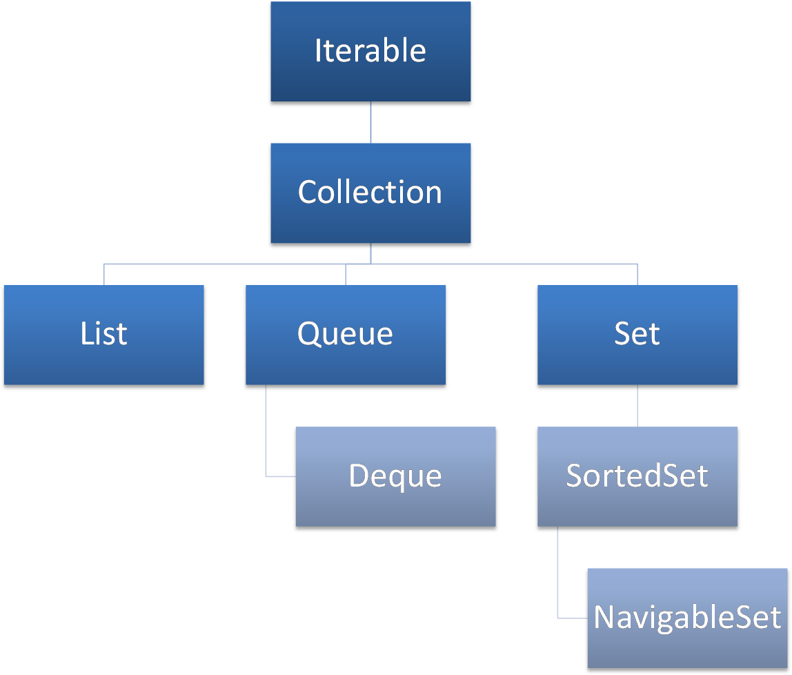
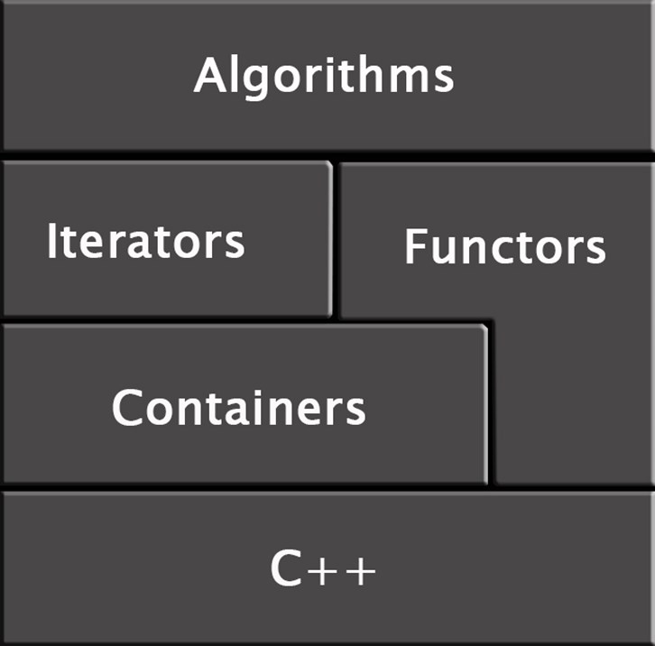
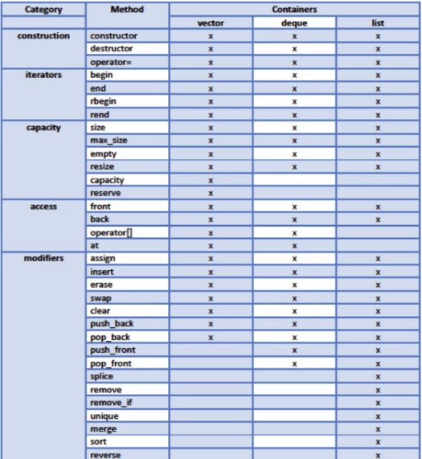

# STL sequential containers

## Quick introduction to Standard Template Library.

### Array

Basically, STL can be divided into two parts:

* Containers, and
* Algorithms.



An array is a very basic container. It has a few limitations:

* the size of an array cannot be changed once instantiated;
* an array does not know its size – this information has to be stored in another variable;
* as a result of the previous point, an array also cannot check if it is properly accessed – 
the index used in the operator cannot be checked;
* an array (one dimension) is organized as one big memory block.

### Standard Template Library

The STL can be divided into the following parts:

* **containers**
* **algorithms**
* **input/output**
* **strings**
* **numeric library**
* **iterators**
* **utilities**
* localizations
* regular expressions
* atomic operations
* thread support
* concepts





The Standard Template Library provides the programmer with a lot of different containers, split into the following subcategories:

* sequential containers:
    * vector
    * list
    * deque
* associative containers:
    * set
    * multiset
    * map
    * multimap
* container adaptors:
    * stack
    * queue
    * priority_queue

### Algorithms

The second biggest STL branch is algorithms.

Different sources divide STL algorithms into different categories. Below you can find a typical list:

* non-modifying sequence operations
* modifying sequence operations
* sorting
* set operations
* binary search
* heap operations
* min/max operations

### Input/output library

input and output operations: console and files

### String library

Is C++'s response to the char * problem. The class string is a solution to many problems related to the processing of character strings.

### Numeric library

A few additional classes are strongly connected to the math world. Examples:

* complex class - which is exactly what you would expect
* valarray type - is a special kind of array which allows for specific mathematical operations, like slicing.

### Iterators

Iterators are generalizations of pointers.

There are five types of iterators to distinguish:

* input iterator
* output iterator
* forward iterator
* bidirectional iterator
* random access iterator

C++ iterators are not defined in any manner of specific type (like a class. Instead, they’re defined by their behavior-supported operations.

### Utilities

 It contains some tools, for example, for date/time manipulation, some supporting types like pair. The most important part is the functional objects (and functions) library.

 ### Sequence Containers

These containers maintain a certain order to the elements inside them.

In this category, the STL offers three solutions:

* vector
* deque
* list




### Vectors

Header:

```c++
<vector>
```

Definition:

```c++
template<

    class T,

    class Allocator = std::allocator<T>

> class vector;
```

The allocator is responsible for providing a memory model for the container elements.

Vector instantiation, example:

```c++
class A;

vector<int> v1;

vector<float> v2;

vector<A> v3;
```
The vector class possesses a few constructor methods, which can be used as needed:

```c++
* explicit vector ( const Allocator& = Allocator() );

* explicit vector ( size_type n, const T& value= T(), 
    const Allocator& = Allocator() );

* template <class InputIterator>
            vector ( InputIterator first, 
                InputIterator last, const Allocator& = Allocator());

* vector ( const vector<T,Allocator>& x );
```

The first constructor is the default constructor. 

Copy constructors: The copy is exact; therefore, every element from the source is copied.


